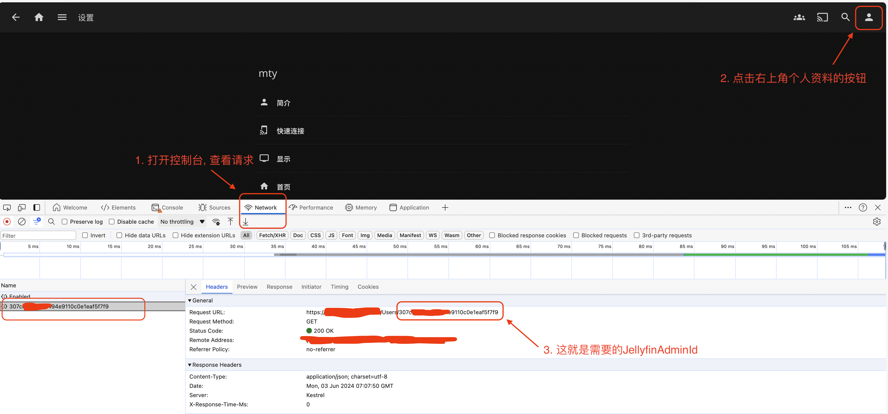
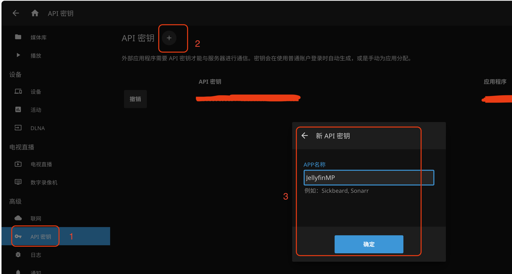
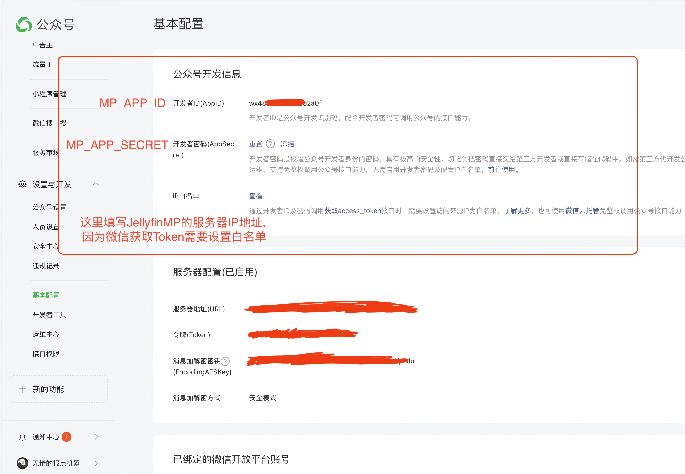

# JellyfinMP

## 介绍

Jellyfin服务器的Webhook插件能够推送新的媒体入库的消息, 基于这一点实现了通过定时任务每天上午9:00生成一篇新的微信公众号文章的功能.

## 快速开始

### 准备工作

1. 拥有完全管理权的Jellyfin服务器, 服务器可暴露在公网. 并且拥有TMM刮削元数据的完整工作流.
2. 作为管理者拥有一个微信订阅号, 不一定需要认证.
3. 部署好的MySql8.0, 并且创建好数据库`jellyfinmp`: `create database jellyfinmp;`.
4. 部署好的Bark服务(可选).

### 前期设置

1. 登录Jellyfin, 生成一个API密钥. (详情见下文参数说明)
2. 登录微信开放平台, 获取AppId和AppSecret. 设置IP白名单, 白名单IP填写运行JellyfinMP的机器. (详情见下文参数说明)
3. 安装和设置Jellyfin的Webhook插件. 可用[这个地址](https://sgp1.mirror.jellyfin.org/releases/plugin/manifest-stable.json)加速插件安装
   1. ServerUrl按照实际填写
   2. 选择Add Generic Destination
   3. Webhook Name 填写 JellyfinMP
   4. Webhook Url 填写 http(s)://你的JellyfinMP部署地址/todo
   5. Notification Type 勾选 Item Added , ItemType 全部勾选, **包括 Send All Properties (ignores template)**
   6. Add Request Header处添加一项key=Content-Type, value=application/json

### 启动
```shell
docker run -d \
  --name jellyfin-mp \
  --restart=unless-stopped \
  -p 58089:8089 \
  -e DATABASE_URL=localhost:3306 \
  -e DATABASE_USER=user \
  -e DATABASE_PASS=pass \
  -e UPDATE_DATABASE=true \
  -e BARK_SERVER=bark.changeme.com \
  -e BARK_DEVICE=changeme_bark_device_id \
  -e JELLYFIN_SERVER_URL=https://jellyfin.example.com \
  -e JELLYFIN_ADMIN=changeme_jellyfin_user_id \
  -e JELLYFIN_TOKEN=changeme_jellyfin_token \
  -e MP_POST_TO_MP_NEWS=false \
  -e MP_SEND_TO_ALL=false \
  -e MP_APP_ID=changeme_app_id \
  -e MP_APP_SECRET=changeme_app_secret \
  jellyfin-mp:latest
```

## 参数说明

### MySql数据库 (必填项)

存储Jellyfin媒体具体信息, 用于生成推送文章.

DATABASE_URL: 数据库连接地址

DATABASE_USER: 数据库用户名

DATABASE_PASS: 数据库密码

### Jellyfin服务器信息 (必填项)

Jellyfin服务器信息.

JELLYFIN_SERVER_URL: Jellyfin的地址.

JELLYFIN_ADMIN: Jellyfin管理员用户的id, 服务器创建时的第一个用户就可用. 获取方式参考下图:



JELLYFIN_TOKEN: Jellyfin的API密钥, 在Jellyfin的后台可以生成. 生成后复制API密钥即可. 获取方式参考下图:



### 微信公众号开发信息 (必填项)

对接必需的信息, 如果没有公众号可参考资料注册一个**订阅号**即可. 

在微信公众平台除了获取到所需的appId和appSecret之外, 还需要填写IP白名单, 因为微信的Token获取是白名单限制的. 

MP_APP_ID: 微信公众平台应用ID

MP_APP_SECRET: 微信公众平台应用密钥

获取和填写方式参考下图:



### 应用本身配置 (非必填)

此应用本身的一些配置选项

UPDATE_DATABASE: 是否更新数据库: 一般来说默认为true即可, 不需要填写此参数, 填写false被用于DEBUG

MP_POST_TO_MP_NEWS: 是否将内容发布到微信普通文章, 一般来说默认为false即可, 不启用这个功能. 这里发布的文章仅仅是从草稿箱发布, 不会推送给订阅用户. 
并且不会出现在公众号历史消息中. 具体参考[微信文档](https://developers.weixin.qq.com/doc/offiaccount/Publish/Publish.html)

MP_SEND_TO_ALL: 是否将内容推送给所有订阅用户. 一般来说默认为false即可, 因为将文章自动推送给订阅用户的能力需要公众号进行认证, 认证有一定的门槛. 
这里填写为false, 每天9:00从草稿箱点击一下群发即可, 顺便也可检查一下生成的内容. 
具体参考[微信文档关于群发消息的说明](https://developers.weixin.qq.com/doc/offiaccount/Getting_Started/Explanation_of_interface_privileges.html)

### Bark推送 (非必填)

[Bark](https://github.com/Finb/Bark) 推送Jellyfin媒体处理情况.

BARK_SERVER: BARK服务器地址

BARK_DEVICE: BARK设备ID, 注册BARK服务后可以获得, 详情移步BARK官方仓库说明


### 所有参数汇总

| 参数名               | 必填 | 默认值                | 说明                               |
|----------------------|----|--------------------|----------------------------------|
| `DATABASE_URL`       | 是  | `localhost:3306`   | 数据库连接URL                         |
| `DATABASE_USER`      | 是  | `user`             | 数据库用户名                           |
| `DATABASE_PASS`      | 是  | `pass`             | 数据库密码                            |
| `UPDATE_DATABASE`    | 否  | `true`             | 是否更新数据库 (false常用于debug, 默认为true) |
| `BARK_SERVER`        | 否  | `http://localhost` | Bark服务器地址                        |
| `BARK_DEVICE`        | 否  | `无`                | Bark设备标识符                        |
| `JELLYFIN_ADMIN`     | 否  | `无`                | Jellyfin管理员用户名                   |
| `JELLYFIN_SERVER_URL`| 否  | `无`                | Jellyfin服务器URL                   |
| `JELLYFIN_TOKEN`     | 否  | `无`                | Jellyfin API令牌                   |
| `MP_POST_TO_MP_NEWS` | 否  | `false`            | 是否将内容发布到微信普通文章（`true` 或 `false`） |
| `MP_SEND_TO_ALL`     | 否  | `false`            | 是否将文章推送给订阅用户（`true` 或 `false`）   |
| `MP_APP_ID`          | 是  | `""`               | 微信公众平台应用ID                       |
| `MP_APP_SECRET`      | 是  | `""`               | 微信公众平台应用密钥                       |
